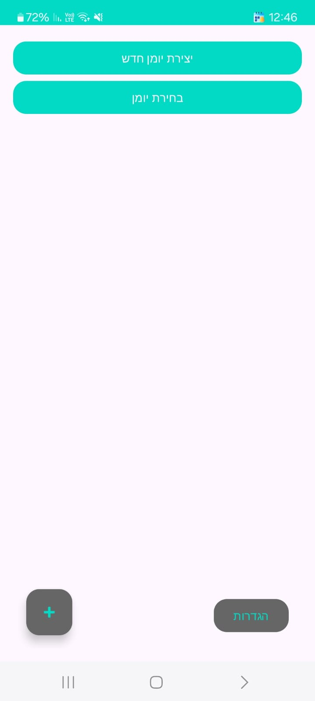
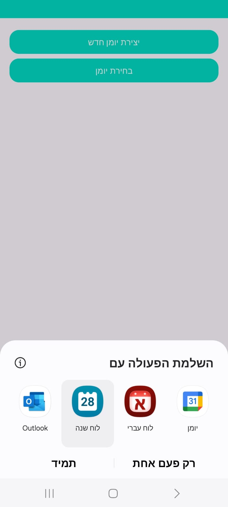
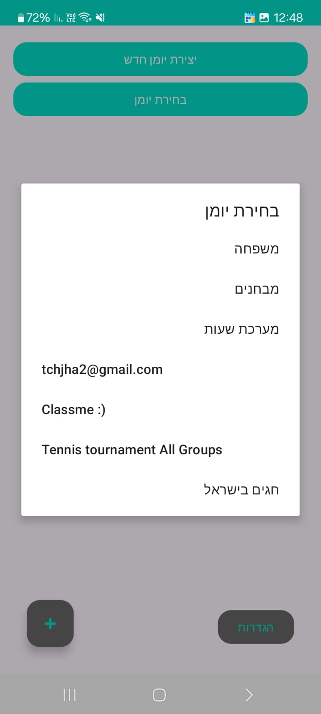
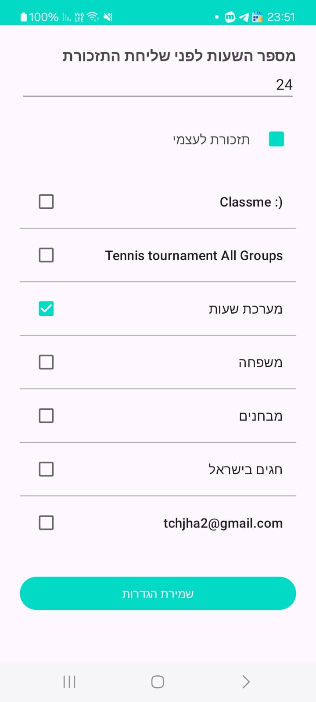

# SmartReminder 📅🔔

**SmartReminder** is a modern Android app that integrates with Google Calendar to help you manage appointments efficiently, with advanced reminders, real-time synchronization, and a user-friendly interface.

---

## ✨ Features

- 🔄 **Automatic calendar sync** with Google accounts
- ➕ **Create appointments** using Google Calendar Intents
- 📅 **Select active calendar** from Google Calendar list
- 🔔 **Custom background reminders** with notification service
- 🛂 **Full runtime permission handling** (Android 13+ included)
- 👥 **Organizer, location, attendee support**
- ✅ **Clean Material Design UI with RecyclerView**
- 🔐 **Firebase Authentication support**

---

## 🛠️ Tech Stack

| Technology             | Purpose                             |
|------------------------|-------------------------------------|
| Kotlin                 | Primary programming language        |
| Android SDK            | Native mobile app development       |
| Firebase Auth          | User authentication                 |
| Retrofit               | REST API client for Google Calendar |
| Google Calendar API    | Calendar and event management       |
| RecyclerView           | Display list of appointments        |
| AlertDialog            | Add/Edit dialogs                    |
| Services               | Background reminder handling        |
| ActivityResultLauncher | Intents and permissions management  |

---

## 🔐 Required Permissions

- `POST_NOTIFICATIONS` (Android 13+)
- Access to Google account (via Google Sign-In)

---

## 🚀 Setup & Run

1. **Clone the project:**

```bash
git clone https://github.com/Avichai98/smartreminder.git
cd smartreminder
```

2. **Open in Android Studio:**

`File > Open > Select project folder`

3. **Set up Firebase & Google APIs:**
    - Add `google-services.json` to `/app`
    - Enable Google Calendar API in Google Cloud Console
    - Add OAuth Client & SHA-1 in Firebase Console

4. **Run the app:**

Connect a device or emulator → Click ▶️ Run

---

## 🖼️ Screenshots

| Home Screen                                                | Add Appointment                                                             | Select Calendar                                                       | Settings                                                |
|------------------------------------------------------------|-----------------------------------------------------------------------------|-----------------------------------------------------------------------|---------------------------------------------------------|
| ! |  |  |  |

---

## 📂 Project Structure

```
📁 smartreminder/
 ┣ 📂 activities/
 ┃ ┣ AppointmentActivity.kt
 ┃ ┣ LoginActivity.kt
 ┃ ┗ SettingsActivity.kt
 ┣ 📂 adapters/
 ┃ ┗ AppointmentAdapter.kt
 ┣ 📂 models/
 ┣ 📂 interfaces/
 ┃ ┗ GoogleCalendarApi.kt
 ┣ 📂 notifications/
 ┃ ┗ EmailSender.kt
 ┣ 📂 services/
 ┃ ┗ AppointmentReminderService.kt
 ┣ 📂 utils/
 ┃ ┣ Utils.kt
 ┃ ┣ BootReceiver.kt
 ┃ ┗ MyRealtimeFirebase.kt
 ┣ App
 ┗ 📂 res/
    ┗ layout/, values/, drawable/
```

---